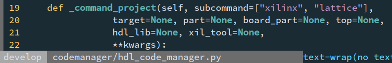
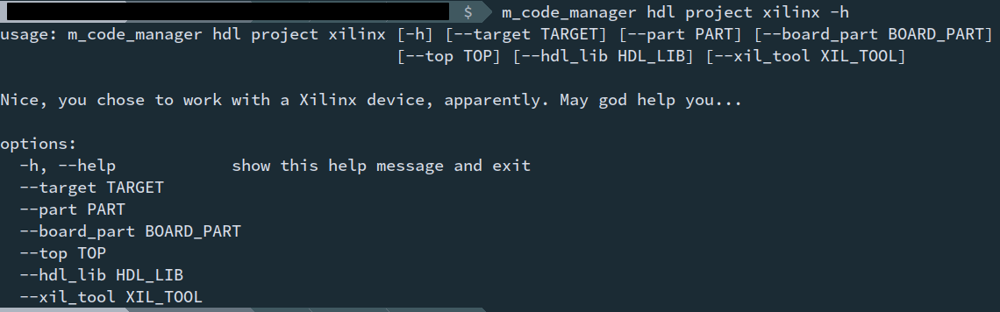
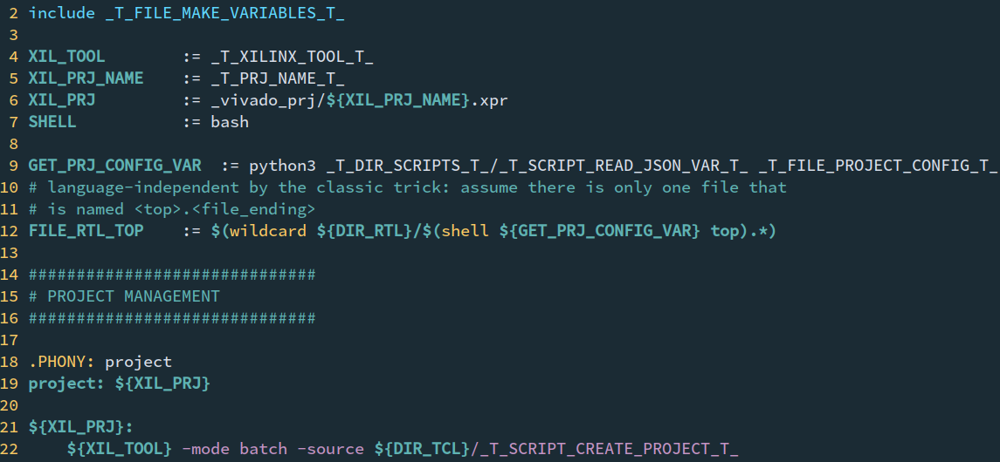
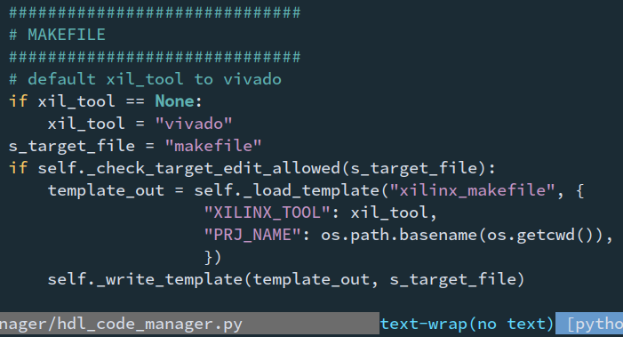

This project is both a framework and a collection of workflows. It helps with 
automating recurring tasks in coding projects and gives you a tool for 
standardizing your personal "project type-specific" project workflow - where 
"project-type likely means programming language - or make use of other people's 
workflows.

`m_code_manager` itself provides an ecosystem for implementing "code managers".  
Those in turn are actually doing the work which otherwise you would have to do 
over and over (if everything goes according to plan...).

Currently available code managers:
- Hardware Description Language (xilinx, incomplete support for vhdl)

Under Construction/Updating:
- C++
- Python
- SystemVerilog

You find the documentation per code manager in the wiki, since they only share 
the implementation framework.

# Examples

Why reading a list of features, when screenshots sometimes tell more than 
a thousand words, right? These are some snippets of a currently implemented 
workflow, to showcase a bit the idea behind the project.

## Automatic command detection and bash auto-completion

The following snippet is part of `codemanager/hdl_code_manager.py`:



Without any more set up, this method being present in a suitable class in the 
correct file structure enables:



(what the command actually does is explained in the [wiki](../../wiki/Code-Manager-%E2%80%90-HDL#project)

## Template Parsing

In `templates/hdl/template_xilinx_makefile`, we have:



With



we can parse that into a makefile for a project flow (given we correctly [added 
a code manager](../../wiki/Adding-a-Code-Manager) of course.

# Features

- automatically derive subcommands and command line options via class member 
  functions
- template parsing engine
- class infrastructure designed to be as easy to extend at possible

# Installation

The problem with making the project executable: From everything that I have 
tried, while symlinking `main.py` will functionally work of course, it breaks 
any command line auto completion and command suggestions. The same holds fro 
aliasing (on my machine). Auto-completion and suggestions are generated via 
python's
[argparse](https://docs.python.org/3/library/argparse.html). If you know how to 
get that to work with symlinks, I would really appreciate if you let me know and 
I can update it here.

For the time being, a startup script is provided by `install/m_code_manager`.  
Copy that file to a `PATH` directory, and in the file, set these lines
```python
# !!! INSERT PATH TO INSTALLATION DIRECTORY !!!
PATH_INSTALLATION="<installation_path>"
# !!! ------------------------------------- !!!
```
to the repo top level directory (`.../.../m_code_manager`).

Considering renaming, I suggest at least having one copy in the `PATH` that is 
exactly named `m_code_manager` (and doing aliasing via additional copies...).  
The reason is that generated code might itself call `m_code_manager`, although 
that should be avoided wherever possible.

I don't like that workaround either, but the effort is manageable and so far 
I haven't found a better way that works.

# Where to find information

Most of the information, both on how to use the existing code managers as well 
as how some internal functionality, can be found in the wiki.

Additionally, the commands and subcommands (should) have `-h/--help` messages.  
But in a lot of cases, I expect them to only refresh users' minds, for the sake 
of conciseness. If you haven't worked with a certain code manager yet, the wiki 
should be the preferred starting point.

# Contributing

If you happen to like the project and implement project flows for your own 
projects in whatever language (and want to invest time in documenting your 
workflow), I would appreciate people extending the set of implemented code 
managers. I am specialising in FPGA design, and occasionally write python and 
mess around with C++. So I myself am not likely to implement project flows for 
anything else than those three, and maybe latex.

